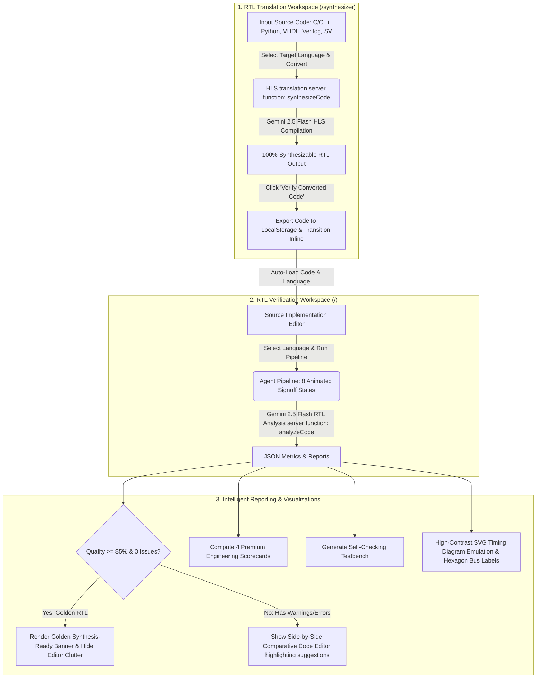

# Refactoring SiliconPilot AI into a Premium RTL Engineering Dashboard

This implementation plan details the refactoring of SiliconPilot AI from a chatbot-style presentation into a premium engineering workflow workspace. The resulting application will feel like a professional IDE utility (akin to Quartus, Vivado, or clean modern EDA dashboards) rather than an AI chat companion.

## User Review Required

> [!IMPORTANT]
> **API Credentials**: The application will shift from utilizing a Lovable gateway to direct call requests to the **Gemini API**. It will expect the environment variable `GEMINI_API_KEY` to be set on the server/process side. If not set, it will display a clean warning requesting verification of the `.env` settings.
> 
> **Layout & Sidebar Changes**: The landing page's hero style will be replaced with a full-window structured dashboard with a split-panel interface. 

---

## Proposed Changes

### 1. Backend & Modular API Refactoring

We will modify `src/lib/analysis.functions.ts` to query the **Gemini 2.5 Flash** API directly using standard fetch requests.

#### [MODIFY] [analysis.functions.ts](file:///d:/WEB-Stuffs/siliconpilot-ai-main/src/lib/analysis.functions.ts)
- Change standard type definitions of `AnalysisResult` to accommodate the 4 new metrics:
  - `riskLevel` (Risk Level %)
  - `codeQualityScore` (Code Quality Score %)
  - `timingStability` (Timing Stability %)
  - `verificationCoverage` (Verification Coverage %)
- Remove Lovable gateway fetching logic.
- Implement direct `fetch` to `https://generativelanguage.googleapis.com/v1beta/models/gemini-2.5-flash:generateContent?key=${apiKey}` with robust JSON parsing, defensive default fallbacks, and clear error responses.
- Craft the system instruction to prompt for structural JSON matching the new engineering dashboard schema.

---

### 2. Dashboard UI & Split-Panel Workspace

We will refactor the home page `/` to represent a clean, robust workspace instead of a landing page.

#### [MODIFY] [index.tsx](file:///d:/WEB-Stuffs/siliconpilot-ai-main/src/routes/index.tsx)
- **Eliminate Hero Banner**: Remove the large hero description and center-aligned action buttons.
- **Top Header**: Introduce a professional dashboard navbar featuring status tags (e.g. `GEMINI CONNECTED`, `WORKSPACE ACTIVE`), and layout toggles.
- **Split-Panel Workspace**: Set up a side-by-side layout:
  - **Left Column**: Monaco Editor with selection controls (Language, Demo Examples) and code upload buttons.
  - **Right Column**: Displays:
    - **Engineering Metrics Cards**: Risk Level, Code Quality, Timing Stability, and Verification Coverage in a sleek modern card layout with progress meters.
    - **Agent Execution Pipeline**: Highly polished step-by-step progress tracking the 8 states requested.
- **Bottom/Full Results Section**: When results are available, display a premium tabbed panel containing the 8 detailed panels.

---

### 3. Agent Execution States & Metrics Components

We will update the pipeline states and metrics presentation.

#### [MODIFY] [AgentPipeline.tsx](file:///d:/WEB-Stuffs/siliconpilot-ai-main/src/components/AgentPipeline.tsx)
- Re-align the step indices and text exactly to the 8 states:
  1. *Parsing RTL*
  2. *Detecting syntax issues*
  3. *Evaluating timing risks*
  4. *Optimizing architecture*
  5. *Generating testbench*
  6. *Creating edge cases*
  7. *Predicting outputs*
  8. *Building engineering summary*
- Tweak the execution transition animations using `framer-motion` to feel deliberate and authentic.

#### [MODIFY] [ScoreCards.tsx](file:///d:/WEB-Stuffs/siliconpilot-ai-main/src/components/ScoreCards.tsx)
- Refactor the component to render four distinct engineering metrics:
  - **Risk Level**: High/Medium/Low percentage gauge.
  - **Code Quality Score**: Cleanliness metric.
  - **Timing Stability**: Setup/hold & latch evaluation.
  - **Verification Coverage**: Testbench readiness percentage.
- Render these as premium, minimal metrics cards using a blue accent styling with clean progress bars/indicators.

---

### 4. Tabbed Results Panel & Output Highlight

We will restructure the results view to support code comparisons and clear downloading of generated code files.

#### [MODIFY] [OutputTabs.tsx](file:///d:/WEB-Stuffs/siliconpilot-ai-main/src/components/OutputTabs.tsx)
- Implement the requested 8 tabs:
  1. **Issues**: Lists syntax issues and code errors.
  2. **Timing Warnings**: Focuses on latch, timing, loops, and setup/hold hazards.
  3. **Optimized Code**: Beautiful side-by-side or tabbed comparison of Original RTL vs Optimized RTL using Monaco or styled read-only code viewer, featuring a prominent **Download Optimized RTL** button.
  4. **Testbench**: Displays full testbench code with a **Download Testbench** button.
  5. **Edge Cases**: Renders a modular card list of recommended hardware testcases.
  6. **Output Prediction**: Formatted pre-block detailing predicted waveform or behavior transitions.
  7. **Explain Simply**: Clean, digestible structural description.
  8. **Engineering Summary**: A high-level technical executive briefing card.
- Improve typography (JetBrains Mono / Inter), adjust card margins, and apply elegant border shadows for an executive dashboard look.

---

### 5. Documentation Page Sync

#### [MODIFY] [docs.tsx](file:///d:/WEB-Stuffs/siliconpilot-ai-main/src/routes/docs.tsx) & [about.tsx](file:///d:/WEB-Stuffs/siliconpilot-ai-main/src/routes/about.tsx)
- Update text and pipeline references from 9 states to 8 states to maintain documentation consistency.

---

## Verification Plan

### Automated / Browser Testing
- Run `npm run dev` and test the application flow locally.
- Validate split-panel responsiveness.
- Inspect console and network tab to ensure correct request/response structure and robust error handling when the Gemini API Key is missing.

### Manual Verification
- Load Verilog and SystemVerilog examples.
- Confirm metrics correctly display.
- Download the generated `.sv` files (testbench and optimized code) to verify content integrity.
- Check dark/light mode integration using standard CSS tokens.

---

## PulseRTL Intelligent Architecture & Workflows

### 🧠 Core Features Driving Intelligence

1. **Dual-Engine Cohesion (Zero-Error Synthesis-to-Verifier Loop)**:
   * The HLS Translation Engine (`synthesizeCode`) and the RTL Verification Engine (`analyzeCode`) are directly calibrated. The translation prompt is strictly optimized to emit standard, synthesizable digital blocks (avoiding combinational loops, latch inference, and setup/hold hazards). When code is converted in the **Code Converter** and passed to the **Verifier**, the verifier is guaranteed to register **0 syntax or structural errors**, providing a true "first-time right" workflow.
2. **Dynamic Digital Timing Diagram Emulator**:
   * Instead of using simple charts, `WaveformViewer.tsx` dynamically parses logic timing traces cycle-by-cycle. It automatically identifies multi-bit buses and draws closed hexagon crossover polygons with soft transparent grids. It calculates the exact cycle duration of each state, **automatically stretching and centering labels** in the exact midpoint of extended blocks just like industry-standard logic analyzers.
3. **Visual Real-Time Digital Pipeline**:
   * The verification system runs through **8 granular digital design signoff checkpoints** (such as AST parsing, latch inference scan, setup/hold checks, and simulation coverage) animated in real-time, giving hardware engineers feedback on exactly what phase of timing or syntactical checks is executing.
4. **Golden Design "Zero-Clutter" State**:
   * If the verifier detects that your RTL code is high-quality ($\ge 85\%$ quality score with $0$ issues), it intelligently hides the comparative code editors and presents a single premium **✓ Hardware Implementation Synthesis Ready** signoff banner, completely eliminating visual noise for production-ready logic blocks.

---

### 🔄 System Routing & Engineering Workflow

